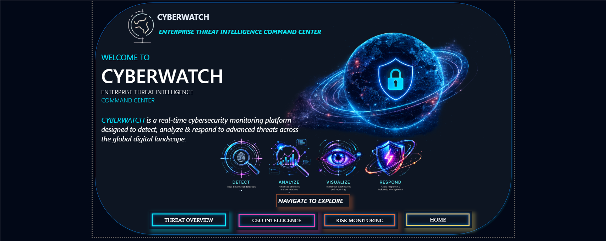
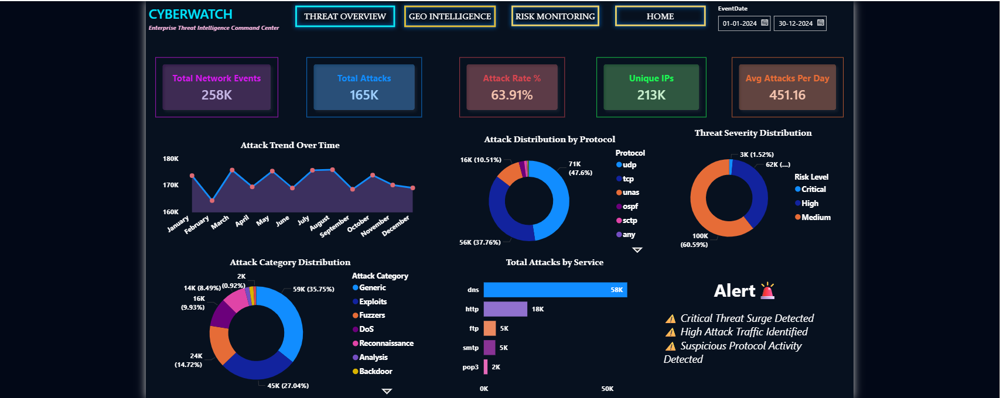
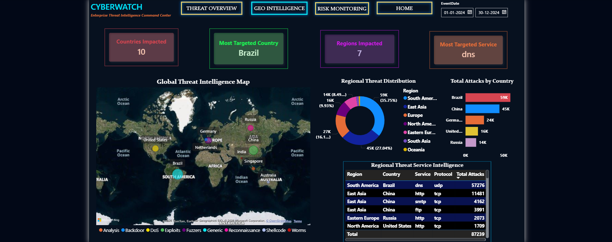
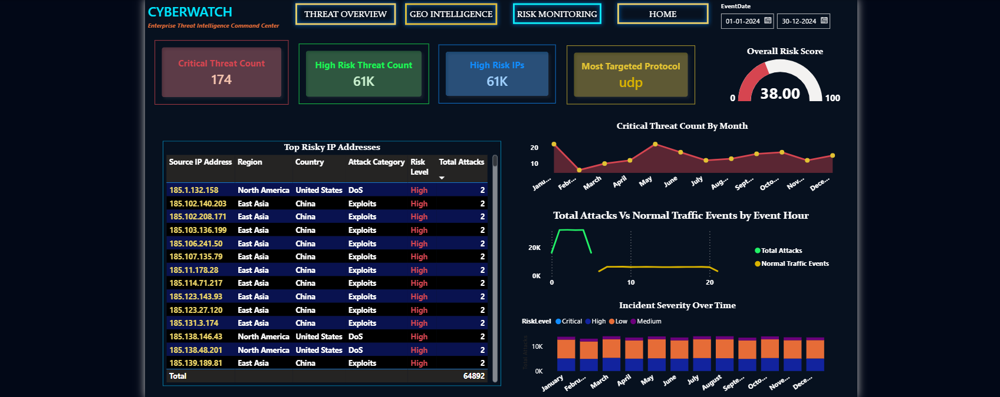

### 🌍 CyberWatch – Enterprise Threat Intelligence Command Center

  

  <b>Cybersecurity Threat Monitoring & Risk Intelligence Platform</b>

  Built using Power BI | Power Query | DAX | Enterprise SOC Design Principles

# 👉 Project Overview

CyberWatch is an enterprise level cybersecurity analytics platform developed using Power BI to monitor, analyze & visualize cyber threats across global network environments.

The project focuses on transforming raw network traffic data into actionable cybersecurity insights through interactive dashboards, risk monitoring systems, geographic threat analysis and SOC-style enterprise visualizations.

This solution was designed to simulate how Security Operations Centers (SOC) monitor suspicious activities, identify attack trends, prioritize critical threats and support cybersecurity decision-making using data analytics.

# 👉 Business Problem

Modern organizations generate massive volumes of network traffic daily, making it difficult for cybersecurity teams to:

- Detect suspicious activities quickly
- Monitor attack trends in real time
- Identify high-risk regions and protocols
- Prioritize critical threats efficiently
- Gain centralized visibility into security events

Traditional monitoring methods often lack visual intelligence and make threat analysis slow and complex.

CyberWatch addresses this challenge by creating a centralized threat intelligence dashboard capable of visualizing attack behavior, monitoring risk patterns, and supporting SOC analysts with data-driven insights.

# 👉  Project Objectives

The main objectives of this project were:

✅ Build an enterprise-style cybersecurity monitoring dashboard

✅ Analyze network attack patterns and threat behavior

✅ Track geographic attack distribution globally

✅ Monitor high-risk activities and suspicious traffic

✅ Create meaningful cybersecurity KPIs using DAX

✅ Design a modern SOC-inspired user interface

✅ Improve visibility into attack trends and threat severity

# 👉  Tools & Technologies Used

| Tool | Purpose |
|---|---|
| Power BI | Dashboard Development & Visualization |
| Power Query | Data Cleaning & Transformation |
| DAX | KPI Calculations & Measures |
| Excel / CSV | Dataset Source |
| Data Modeling | Relationship Architecture |
| Cybersecurity Analytics | Threat Monitoring & Risk Analysis |

# 📂 Dataset Information

The project uses a combination of the **UNSW_NB15 cybersecurity dataset from Kaggle** along with additional simulated enterprise threat data created to enhance SOC-style monitoring and visualization.

The dataset includes:

* Network traffic records
* Attack labels
* Threat severity levels
* Protocol information
* Service categories
* Geographic regions
* Country-level activity
* Session durations
* Event timestamps
* Simulated source and destination IP addresses
* Risk monitoring fields
* Attack behavior patterns
> ⚠️ Note: A sample version of the dataset has been uploaded due to GitHub file size limitations.

# 👉  Business Impact

CyberWatch helps simulate how enterprise SOC teams can:

✅ Monitor threats centrally

✅ Improve attack visibility

✅ Prioritize critical incidents

✅ Analyze geographic attack behavior

✅ Support cybersecurity decision-making

✅ Enhance operational efficiency using visual analytics

The project demonstrates how business intelligence tools such as Power BI can support cybersecurity analytics and improve threat monitoring workflows through interactive visual storytelling.

# 👉  Data Cleaning & Preparation

Data preparation was performed using Power Query.

### Key transformations performed:

- Removed null and inconsistent values
- Standardized risk level categories
- Handled missing service classifications
- Created region mappings
- Generated realistic source and destination IP addresses
- Created event date and event hour fields
- Optimized data types for performance
- Structured data for dashboard analysis

# 👉 Data Modeling

The dashboard follows a structured **star schema architecture** designed for optimized filtering, scalable reporting, and enterprise-level dashboard performance.

The data model was built to support cybersecurity analytics, time-based analysis, geographic threat monitoring, and KPI calculations efficiently inside Power BI.

  

# 📂 Tables Used in the Data Model

| Table Name          | Table Type           | Description                                                                                                                                                                 |
| ------------------- | -------------------- | --------------------------------------------------------------------------------------------------------------------------------------------------------------------------- |
| Fact_NetworkTraffic | Fact Table           | Main transactional table containing network traffic records, attack labels, protocols, services, threat severity, IP addresses, session activity, and attack behavior data. |
| Dim_Date            | Dimension Table      | Date hierarchy table used for time intelligence analysis including year, month, daily attack trends, and attack timing analysis.                                            |
| Dim_Region          | Dimension Table      | Geographic mapping table used to categorize countries into regions such as Asia, Europe, North America, etc.                                                                |
| Dim_AttackCategory  | Dimension Table      | Stores different attack categories such as DoS, Exploits, Reconnaissance, Fuzzers, Generic, and other cyber attack classifications.                                         |
| Dim_Protocol        | Dimension Table      | Contains protocol information such as TCP, UDP, ICMP, and other network communication protocols used for protocol-based analysis.                                           |
| Dim_Service         | Dimension Table      | Stores network service categories such as HTTP, DNS, FTP, SMTP, SSH, and other targeted services.                                                                           |
| Dim_RiskLevel       | Dimension Table      | Contains cybersecurity risk classifications such as Low, Medium, High, and Critical threat levels.                                                                          |
| Dim_IPAddress       | Supporting Dimension | Used for handling simulated source and destination IP address analysis and suspicious traffic monitoring.                                                                   |

# 📌 Data Modeling Features

✅ Star schema architecture for efficient filtering

✅ Optimized relationships between fact and dimension tables

✅ Improved dashboard performance and scalability

✅ Time intelligence support using Dim_Date

✅ Geographic analysis support using Dim_Region

✅ Dynamic filtering across multiple dashboards

✅ Structured DAX KPI calculations

✅ Enterprise-style analytical model design

# 📊 Key KPIs Created

The project includes enterprise cybersecurity metrics such as:

| KPI | Description |
|---|---|
| Total Attacks | Total detected attack events |
| Attack Rate % | Percentage of attack traffic |
| Critical Threat Count | Total critical severity threats |
| High Risk Threat Count | High-risk suspicious activities |
| Risk Score | Weighted threat severity score |
| Most Targeted Service | Most attacked network service |
| Unique IPs | Distinct suspicious IP activity |
| Average Attacks Per Day | Daily attack monitoring metric |

# 🖥️ Dashboard Pages

### 🏠 1. Home Command Center

Centralized enterprise landing page for navigating the entire cybersecurity monitoring platform.

### Features:
- SOC-style futuristic UI
- Enterprise navigation system
- Threat intelligence overview
- Interactive command center layout

  

### ⚠️ 2. Threat Overview Dashboard

Provides complete visibility into attack trends, protocol behavior, threat severity, and targeted services.

### Visuals Included:
- Attack Trend Over Time
- Threat Severity Distribution
- Attack Distribution by Protocol
- Service Attack Analysis
- KPI Monitoring Cards

### Business Value:
Helps analysts quickly identify attack spikes, suspicious protocols, and high-risk services.

  

### 🌍 3. Geo Intelligence Dashboard

Global threat monitoring dashboard focused on geographic attack analysis.

### Visuals Included:
- Global Attack Heat Map
- Regional Threat Analysis
- Country-Level Attack Monitoring
- Service & Protocol Breakdown by Region

### Business Value:
Supports geographic threat intelligence and identifies regions with elevated attack activity.

  

### 🚨 4. Risk Monitoring Dashboard

Focused on high-risk activity tracking and suspicious threat behavior monitoring.

### Visuals Included:
- Risk Score Monitoring
- Attack Timing Analysis
- High-Risk Activity Trends
- Suspicious Traffic Investigation

### Business Value:
Helps SOC teams prioritize critical threats and monitor abnormal attack behavior.

  

# 👉 Key Insights & Findings

### 📌 Attack Behavior Insights

- DNS,HTTP services & UDP Protocol were heavily targeted
- High-risk attacks occurred mainly during late-night hours
- Attack spikes were concentrated during specific periods
- Critical threats had lower frequency but significantly higher severity

### 📌 Geographic Insights

- Asia and North America showed elevated attack activity
- Multiple regions displayed concentrated threat patterns
- Geographic analysis improved attack visibility globally

### 📌 Operational Insights

- High-risk traffic patterns were identified effectively
- Threat severity distribution improved incident prioritization
- KPI monitoring simplified SOC decision-making

# 👉 Dashboard Design Highlights

The dashboard was designed using modern SOC-inspired UI principles.

### Design Features

✅ Dark enterprise cybersecurity theme

✅ Neon cyberpunk-inspired color palette

✅ Interactive multi-page navigation

✅ Glowing enterprise visual cards

✅ Cinematic threat intelligence layouts

✅ Executive-style dashboard storytelling

# 👉 Challenges Faced

During development, several challenges were addressed:

| Challenge | Solution |
|---|---|
| Missing service values | Applied meaningful category handling |
| Simulating realistic threat activity | Created logical attack behavior patterns |
| Designing enterprise UI | Used SOC-inspired dashboard layouts |
| Dashboard consistency | Maintained unified styling across pages |
| KPI engineering | Built dynamic DAX measures |

# 👉 Business Impact

CyberWatch helps simulate how enterprise SOC teams can:

✅ Monitor threats centrally

✅ Improve attack visibility

✅ Prioritize critical incidents

✅ Analyze geographic attack behavior

✅ Support cybersecurity decision-making

✅ Enhance operational efficiency using visual analytics

# 👉 Future Enhancements

Potential future improvements include:

- Real-time streaming data integration
- SIEM connectivity
- AI-based anomaly detection
- Automated threat alerting
- Predictive cybersecurity analytics
- Live SOC monitoring integration

# 👉 Project Preview

### Home Command Center

### Threat Overview

### Geo Intelligence

## Risk Monitoring

